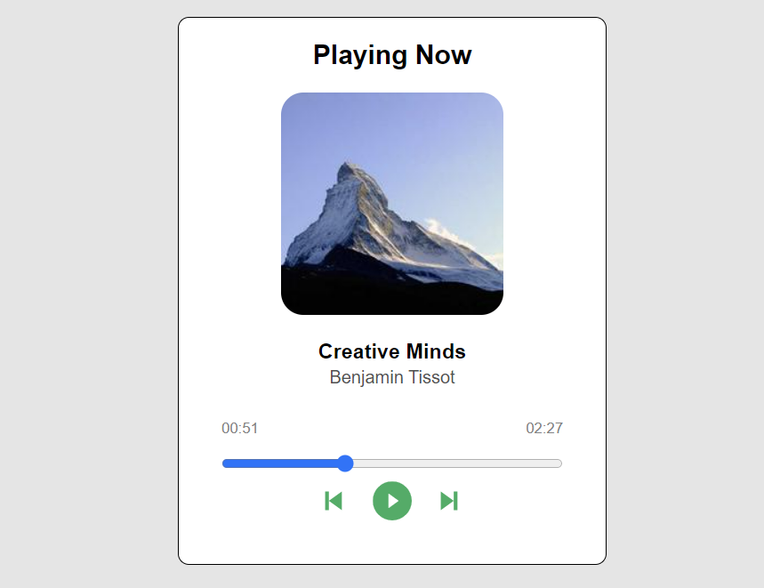

# React Music Player

Simple music player made with React.

## Run project

In the project directory, you can run:

`npm start`

This will run the app in the development mode.\
Open [http://localhost:3000](http://localhost:3000) to view it in your browser.
